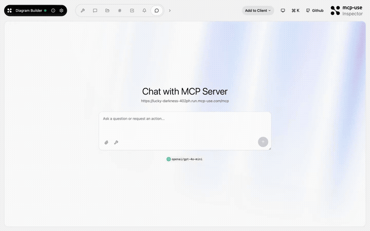
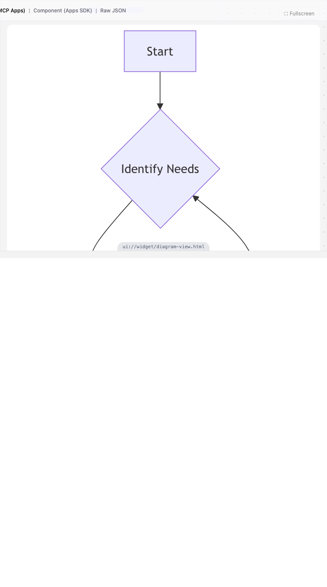

# Diagram Builder — Mermaid diagrams in your chat

<p>
  <a href="https://github.com/mcp-use/mcp-use">Built with <b>mcp-use</b></a>
  &nbsp;
  <a href="https://github.com/mcp-use/mcp-use">
    
  </a>
</p>

Interactive diagram MCP App powered by [Mermaid.js](https://mermaid.js.org/). The model generates flowcharts, sequence diagrams, class diagrams, and more that render live inside the conversation with streaming support.



## Try it now

Connect to the hosted instance:

```
https://lucky-darkness-402ph.run.mcp-use.com/mcp
```

Or open the [Inspector](https://inspector.manufact.com/inspector?autoConnect=https%3A%2F%2Flucky-darkness-402ph.run.mcp-use.com%2Fmcp) to test it interactively.

### Setup on ChatGPT

1. Open **Settings** > **Apps and Connectors** > **Advanced Settings** and enable **Developer Mode**
2. Go to **Connectors** > **Create**, name it "Diagram Builder", paste the URL above
3. In a new chat, click **+** > **More** and select the Diagram Builder connector

### Setup on Claude

1. Open **Settings** > **Connectors** > **Add custom connector**
2. Paste the URL above and save
3. The Diagram Builder tools will be available in new conversations

## Features

- **Streaming props** — diagrams render progressively as the model generates the Mermaid syntax
- **Multiple diagram types** — flowchart, sequence, class, state, ER, gantt, pie, mindmap, timeline
- **Theme support** — light and dark mode (Mermaid native themes)
- **Fullscreen mode** — expand diagrams for detailed viewing
- **Edit support** — iteratively refine diagrams with the `edit-diagram` tool

## Tools

| Tool | Description |
|------|-------------|
| `create-diagram` | Create a diagram from Mermaid syntax with optional title and type hint |
| `edit-diagram` | Update an existing diagram with new Mermaid syntax |

## Available Widgets

| Widget | Preview |
|--------|---------|
| `diagram-view` |  |

## Local development

```bash
git clone https://github.com/mcp-use/mcp-diagram-builder.git
cd mcp-diagram-builder
npm install
npm run dev
```

The server starts at `http://localhost:3000/mcp` with the Inspector at `http://localhost:3000/inspector`.

## Deploy

```bash
npx mcp-use deploy
```

## Built with

- [mcp-use](https://github.com/mcp-use/mcp-use) — MCP server framework
- [Mermaid.js](https://mermaid.js.org/) — diagramming library (bundled, no CDN required)

## License

MIT
